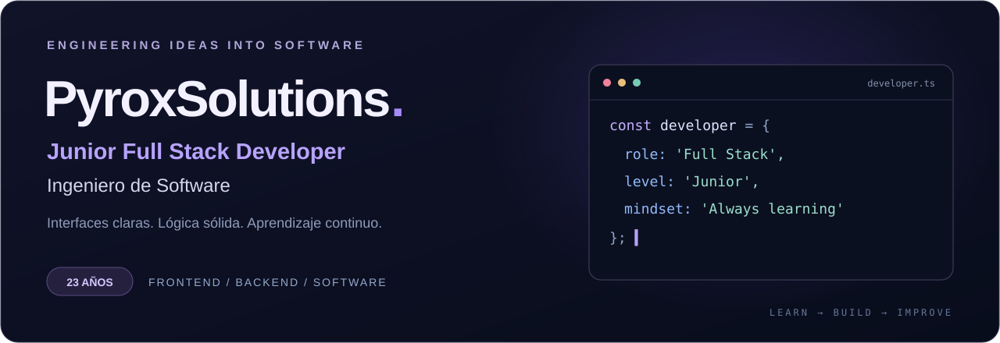

  

<h1 align="center">Hola, soy PyroxSolutions 👋</h1>

  <strong>Ingeniero de Software · Junior Full Stack Developer</strong> 
  23 años · Desarrollo de software · Aprendizaje continuo

  <a href="#sobre-mí">Sobre mí</a> &nbsp; / &nbsp;
  <a href="#tech-stack">Tech Stack</a> &nbsp; / &nbsp;
  <a href="#cómo-trabajo">Cómo trabajo</a> &nbsp; / &nbsp;
  <a href="mailto:pyrox.softwares@gmail.com">Contacto</a>

 

## Sobre mí

Soy **ingeniero de software y desarrollador Junior Full Stack**, con interés en crear aplicaciones que combinen una buena experiencia de usuario con una lógica clara y bien estructurada.

Me gusta conectar el **frontend y el backend**, entender cómo funciona cada parte de una aplicación y convertir ideas en soluciones útiles. Trabajo con **React, JavaScript, TypeScript, Node.js y Lua**, mientras sigo fortaleciendo mis conocimientos y buenas prácticas de desarrollo.

> Mi enfoque: aprender con intención, construir con criterio y mejorar en cada iteración.

## Tech Stack

  

 

| Área | Tecnologías y herramientas |
| :--- | :--- |
| **Frontend** | React · JavaScript · TypeScript · HTML5 · CSS3 · Tailwind CSS |
| **Backend y scripting** | Node.js · Lua |
| **Herramientas de desarrollo** | Git · GitHub · Visual Studio Code · Vite |
| **Intereses técnicos** | APIs · Automatización · Integración de IA · Accesibilidad web |

## Cómo trabajo

<table>
<tr>
<td width="50%" valign="top">
<h3>🧩 Pensar antes de programar</h3>

Entender el problema, dividirlo en partes y elegir una solución que sea fácil de mantener.

</td>
<td width="50%" valign="top">
<h3>🎨 Cuidar la experiencia</h3>

Prestar atención a las interfaces, la claridad de las interacciones y los detalles visuales.

</td>
</tr>
<tr>
<td width="50%" valign="top">
<h3>⚙️ Construir con orden</h3>

Priorizar código legible, componentes reutilizables y una estructura clara.

</td>
<td width="50%" valign="top">
<h3>🌱 Mejorar continuamente</h3>

Aprender nuevas herramientas, escuchar feedback y refinar las soluciones paso a paso.

</td>
</tr>
</table>

## Mi siguiente nivel

Seguir creciendo en **arquitectura de aplicaciones, diseño de APIs, pruebas y buenas prácticas**, con una visión cada vez más completa del desarrollo de software.

---

<h3 align="center">Conectemos</h3>

  ¿Tienes una idea, una oportunidad o ganas de hablar de tecnología?  
  <a href="mailto:pyrox.softwares@gmail.com"><strong>✉️ pyrox.softwares@gmail.com</strong></a>

  PyroxSolutions · Learn. Build. Improve.

