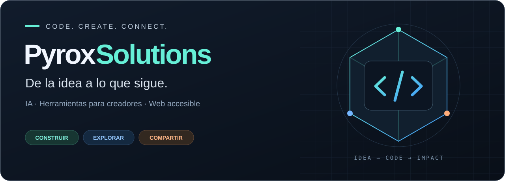
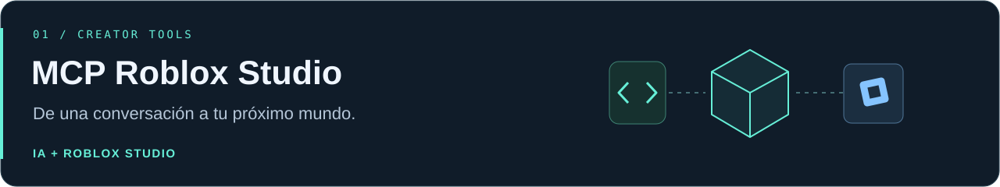
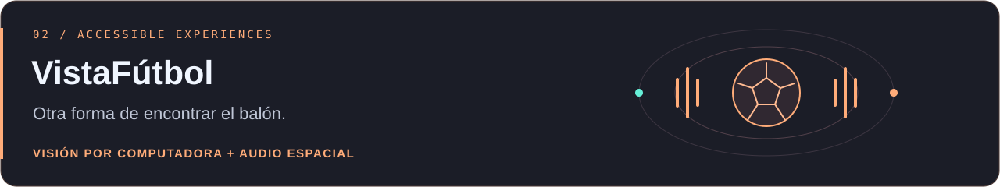
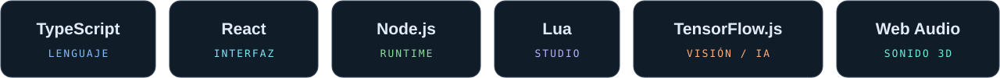

  

  <a href="#proyectos-destacados">Proyectos</a> &nbsp; · &nbsp;
  <a href="#tecnologías">Tecnologías</a> &nbsp; · &nbsp;
  <a href="mailto:pyrox.softwares@gmail.com">Contacto</a>

### Hola, soy PyroxSolutions 👋

Construyo herramientas que acercan la **inteligencia artificial al proceso creativo** y experiencias web que exploran nuevas formas de interactuar con el mundo. Aquí encontrarás proyectos de **MCP, Roblox Studio y accesibilidad**: ideas convertidas en código que puedes explorar, usar y mejorar.

## Proyectos destacados

Un puente entre clientes de IA compatibles con MCP y Roblox Studio. Permite crear y editar **scripts, mapas y modelos** desde una conversación, mediante un servidor Node.js y un plugin de Studio.

**Lua · TypeScript · Node.js · Model Context Protocol** 
[Explorar código →](https://github.com/PyroxSolution/mcp-roblox-studio) · [Guía de instalación](https://github.com/PyroxSolution/mcp-roblox-studio/blob/main/docs/INSTALL.md)

 

Una PWA que explora cómo la **visión por computadora y el audio espacial 3D** pueden ayudar a personas con discapacidad visual a jugar fútbol. Desarrollada para el Hackatón de Innovación Inclusiva 2026.

**React · TypeScript · TensorFlow.js · Web Audio API · PWA** 
[Explorar código →](https://github.com/PyroxSolution/VistaFutbol) · [Ver demo](https://vistafutbol.vercel.app)

## Tecnologías

  

## Lo que me mueve

- **Crear con IA.** Conectar modelos con herramientas que permiten construir cosas reales.
- **Facilitar la creación.** Reducir la distancia entre una idea y un proyecto funcionando.
- **Explorar la accesibilidad.** Diseñar interacciones que aprovechen visión, sonido y web.
- **Compartir el proceso.** Publicar código y documentación para que otros puedan aprender y aportar.

---

  <b>Las buenas ideas empiezan con una conversación.</b> 
  <a href="mailto:pyrox.softwares@gmail.com">pyrox.softwares@gmail.com</a>  
  PyroxSolutions · Construir. Explorar. Compartir.

